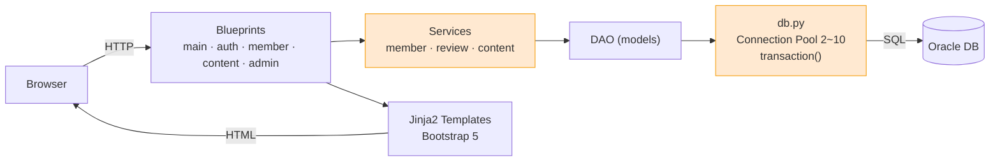

# 시스템 아키텍처

```mermaid
flowchart LR
    B["Browser"] -->|HTTP| BP["Blueprints<br/>main · auth · member · content · admin"]
    BP --> SV["Services<br/>member · review · content"]
    SV --> DAO["DAO (models)"]
    DAO --> POOL["db.py<br/>Connection Pool 2~10<br/>transaction()"]
    POOL -->|SQL| ORA[("Oracle DB")]
    BP --> TPL["Jinja2 Templates<br/>Bootstrap 5"]
    TPL -->|HTML| B

    style SV fill:#ffe9d1,stroke:#f59e0b
    style POOL fill:#ffe9d1,stroke:#f59e0b
```

트랜잭션 경계를 서비스 계층에 두어 하나의 비즈니스 동작이 하나의 트랜잭션이 되도록 했습니다. 주황색이 담당 영역입니다.
