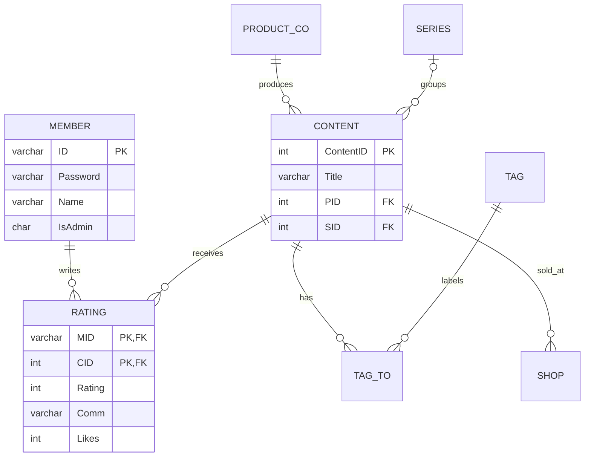

# ERD

```mermaid
erDiagram
    MEMBER ||--o{ RATING : writes
    CONTENT ||--o{ RATING : receives
    PRODUCT_CO ||--o{ CONTENT : produces
    SERIES |o--o{ CONTENT : groups
    CONTENT ||--o{ TAG_TO : has
    TAG ||--o{ TAG_TO : labels
    CONTENT ||--o{ SHOP : sold_at

    MEMBER {
        varchar ID PK
        varchar Password
        varchar Name
        char IsAdmin
    }
    RATING {
        varchar MID PK,FK
        int CID PK,FK
        int Rating
        varchar Comm
        int Likes
    }
    CONTENT {
        int ContentID PK
        varchar Title
        int PID FK
        int SID FK
    }
```

`RATING`의 복합 PK `(MID, CID)`가 "회원 1명당 콘텐츠 1개에 리뷰 1개" 규칙을 DB 수준에서 보장합니다. 전체 DDL은 [`app/DBreset_table.sql`](../app/DBreset_table.sql)에 있습니다.

